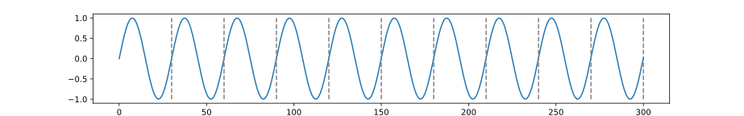
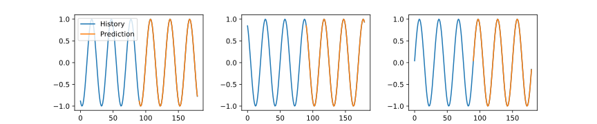
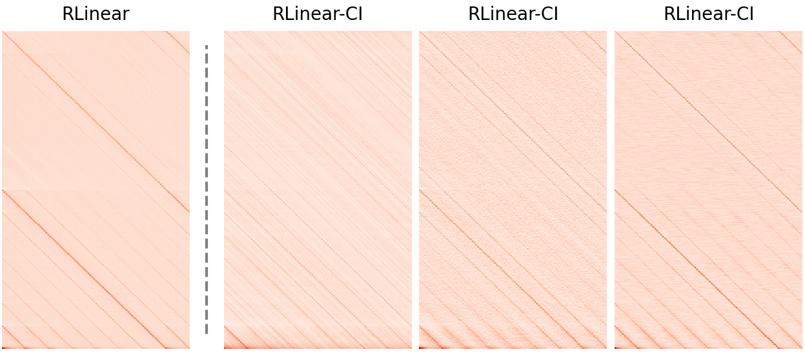

# RTSF
This is a simplified documentation of [Revisiting Long-term Time Series Forecasting: An Investigation on Linear Mapping](https://arxiv.org/abs/2305.10721).

## Linear Mapping on LTSF

**Problem Definition.** Given a historical time series observation $\mathbf{X}=[\boldsymbol{x} _1,\boldsymbol{x} _2,\dots,\boldsymbol{x} _n]\in\mathbb{R}^{c\times n}$ with $c$ channels and $n$ time steps, forecasting tasks aim to predict the next $m$ time steps $\mathbf{Y}=[\boldsymbol{x} _ {n+1},\boldsymbol{x} _ {n+2},\dots,\boldsymbol{x} _ {n+m}]\in\mathbb{R}^{c\times m}$ where $m$ denotes forecasting horizon. We need to learn a map $\mathcal{F}:\mathbf{X}^{c\times n}\mapsto\mathbf{Y}^{c\times m}$ where $\mathbf{X}$ and $\mathbf{Y}$ are consecutive in the original time series data. Consider a single linear layer as

```math
[\boldsymbol{x}_1, \boldsymbol{x}_2, \dots, \boldsymbol{x}_n]\cdot\mathbf{W}+\mathbf{b}=[\boldsymbol{x}_{n+1}, \boldsymbol{x}_{n+2}, \dots, \boldsymbol{x}_{n+m}],
```

where $\mathbf{W}\in\mathbb{R}^{n\times m}$ is the weight, also termed as the transition matrix, and $\mathbf{b}\in\mathbb{R}^{1\times m}$ is the bias. The following theorems depicts the role of linear mapping in long-term time series forecasting. See the original paper for the complete proof.

**Theorem 1.** Given a seasonal time series satisfying $x(t)=x(t-p)$ where $p\leq n$ is the period, there always exists an analytical solution for the linear model as

$$\mathbf{W}_{ij}^{(k)}=
\begin{cases}
  1, & \text{if $i=n-kp+(j\bmod{p})$} \\
  0, & \text{otherwise} \\
\end{cases},1\leq k\in\mathbb{Z}\leq\lfloor n/p\rfloor,b_i=0.$$

**Corollary 1.1.** When the given time series satisfies $x(t)=ax(t-p)+c$ where $a,c$ are scaling and translation factors, the linear model still has a closed-form solution as

$$\mathbf{W}_ {ij}^{(k)}=
\begin{cases}
  a^k, & \text{if $i=n-kp+(j\bmod{p})$} \\
  0, & \text{otherwise} \\
\end{cases},1\leq k\in\mathbb{Z}\leq\lfloor n/p\rfloor,b_i=\sum_{l=0}^{k-1}a^l\cdot c.$$

**Theorem 2.** Let $x(t)=s(t)+f(t)$ where $s(t)$ is a seasonal signal with period $p$ and $f(t)$ satisfies K-Lipschitz continuous. Then there exists a linear model as Equation~\ref{eq:2} with input horizon size $n=p+\tau,\tau\geq0$ such that $\vert x(n+j)-\hat{x}(n+j)\vert\leq K(p+j), j=1,\dots,m$.

**Theorem 3.** Let $\mathbf{X}=[\boldsymbol{s}_1,\boldsymbol{s}_2,\dots,\boldsymbol{s}_c]^\top\in\mathbb{R}^{c\times n}$ be the input historical multivariate time series with $c$ channels and the length of $n$. If each signal $\boldsymbol{s}_i$ has a corresponding period $p_i$, there must be a linear model $\mathbf{Y}=\mathbf{X}\mathbf{W}+\mathbf{b}$ that can predict the next $m$ time steps when $n\geq\text{lcm}(p_1,p_2\dots,p_c)$.

## Showcase on Simulated Sine Wave

Consider a sine wave $y=\sin(\frac{2\pi}{30} x)$ with a period of 30 as follows. 



Let the length of input historical observation and prediction horizon be 90. According to Theorem 1, we can obtain the solution to $\mathbf{W}^{(k)}$ when $k=1,2,3$. Notably, any linear combination of $[\mathbf{W}^{(1)},\mathbf{W}^{(2)},\mathbf{W}^{(3)}]$ still satisfies prediction conditions as long as the coefficients sum up to 1. Additionally, this method of prediction based on periodicity is **not sensitive** to the form of the input data. That's why a single linear layer performs well on many real-world datasets due to their seasonality in days, weeks, months, and years.




## Limitations

Although Theorem 3 provides a solution for predicting multivariate time series with different periodic channels, an excessively long input horizon may make the optimization of $\mathbf{W}$ difficult due to its sparsity. The figure below shows different $\mathbf{W}$ in RLinear and RLinear-CI where the length of input horizon is 336 and prediction horizon is 192. Apparently, with the help of CI, different projection layers have learned different periodic features, which are more detailed. A single linear layer focuses more on global periodicity, but prone to forget fine-grained periodic features. The study of how to balance periodicity at different scales requires further investigation.



## Citation

If you find this repo useful, please cite our paper. 

```
@article{Li2023RevisitingLT,
  title={Revisiting Long-term Time Series Forecasting: An Investigation on Linear Mapping},
  author={Zhe Li and Shiyi Qi and Yiduo Li and Zenglin Xu},
  journal={ArXiv},
  year={2023},
  volume={abs/2305.10721}
}
```

## Contact

If you have any questions or want to discuss some details, please contact plum271828@gmail.com.

## Acknowledgement

We appreciate the following github repos a lot for their valuable code base or datasets:

https://github.com/zhouhaoyi/Informer2020

https://github.com/ts-kim/RevIN

https://github.com/cure-lab/LTSF-Linear
